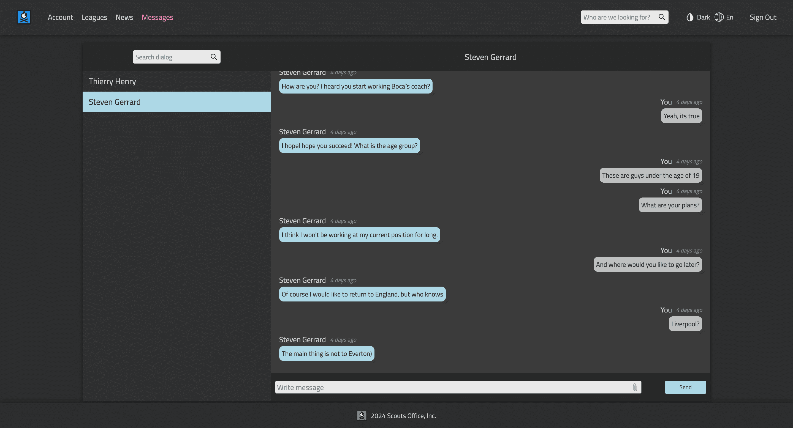

### Scouts Office App in development...

This is an application for monitoring football players, analyzing their statistics and prices in the transfer market

Visit the website: in development....




___

### Getting Started

To run the Scouts App locally, follow these steps:

+ Clone the repository:
   ```
   git clone https://github.com/boMadBo/scouts-office-client.git
   ```

+ install the required dependencies:
   ```
   yarn install
   ```

+  to run
   ```
   yarn start
   ```

Runs the app in development mode. Open http://localhost:3010 to view it in the browser.

### Swagger docs http://localhost:3014/api/doc/


